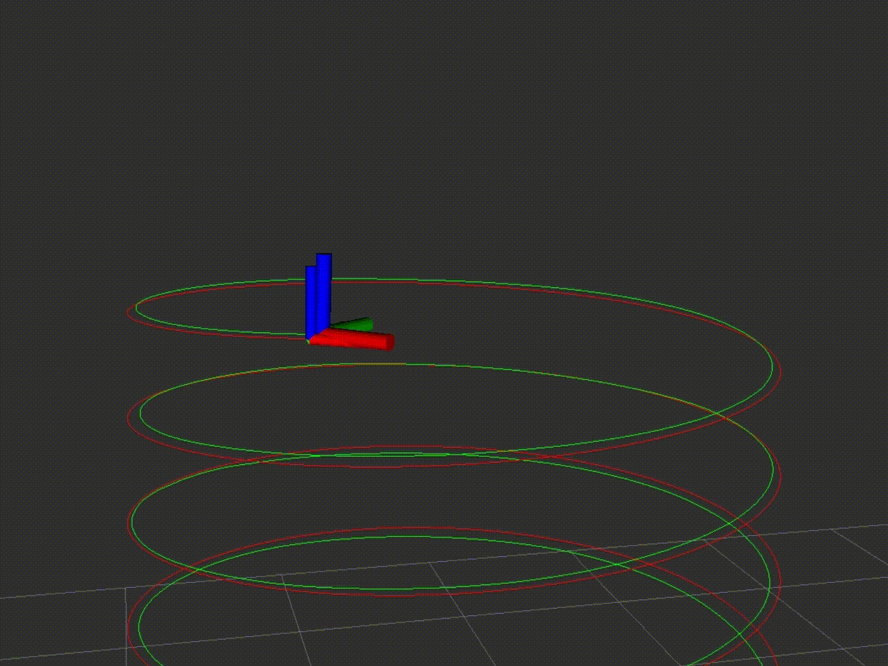
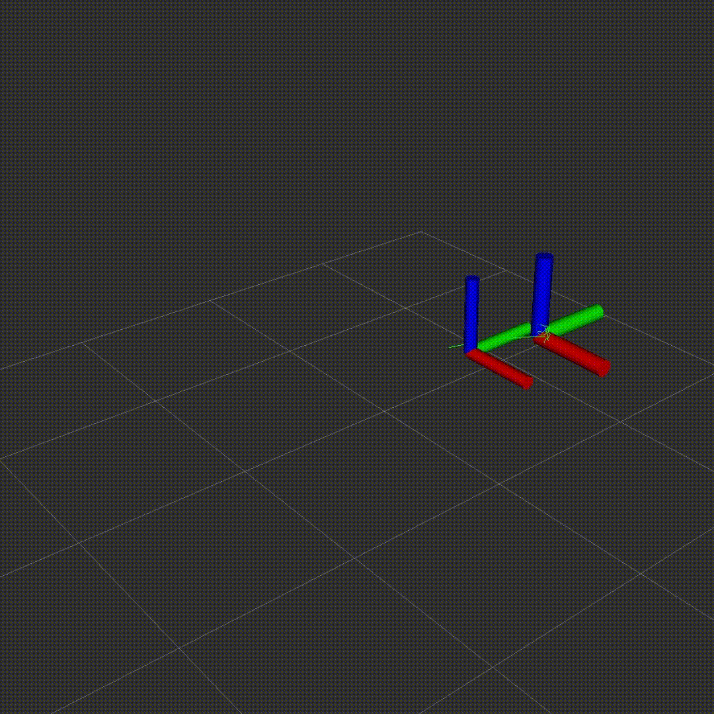
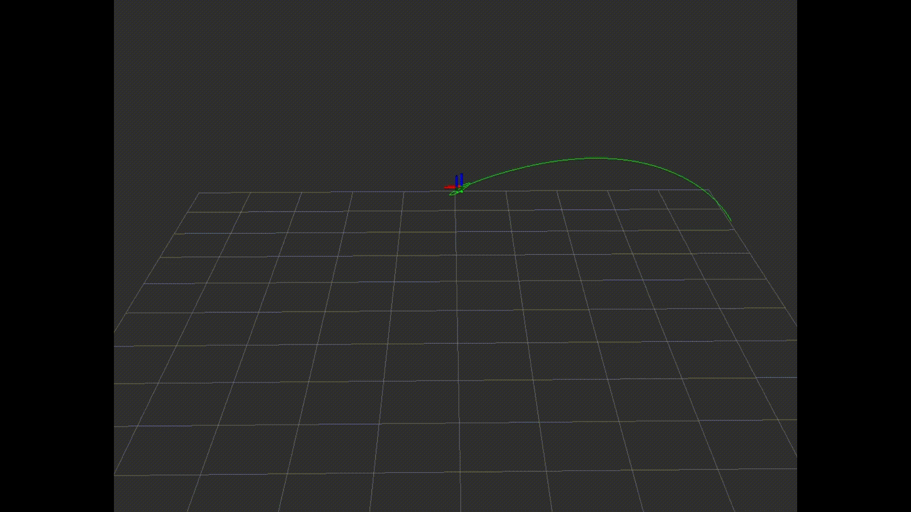
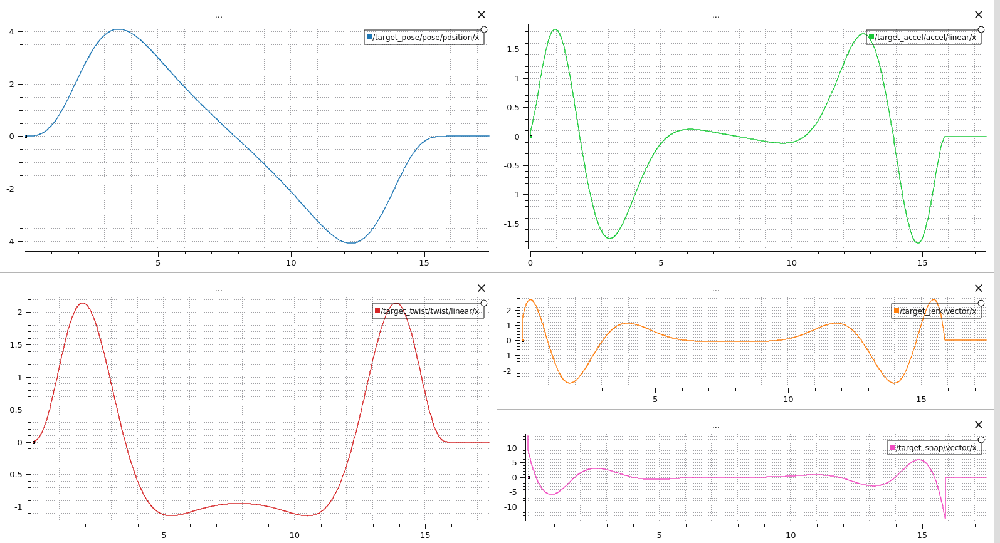
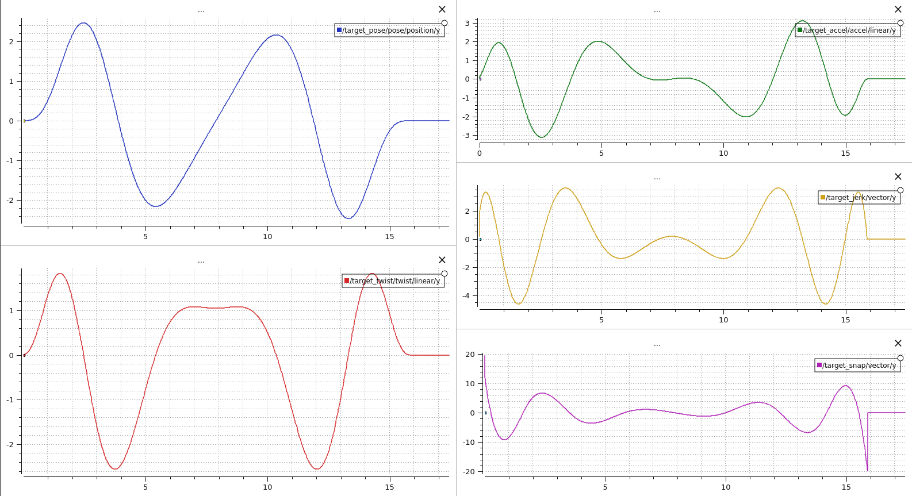
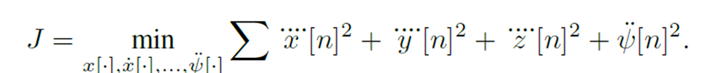
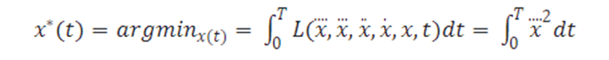
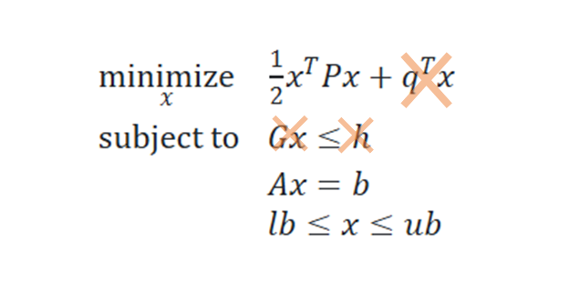
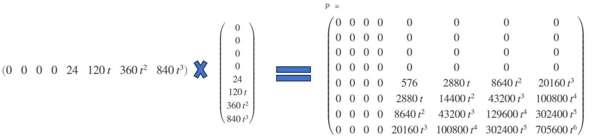
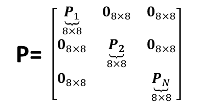

# Trajectory generators for UAVs 
This is a ROS2 package that provides multiple trajectory generators such as minimum snap (or other derivatives) trajectory using waypoints provided.
Multiple implementations use linear algebra (matrix inverse) and quadratic programming.

# Dependencies:
- This was tested using ROS2 foxy in Ubuntu 20.04 
- Python version: Python 3.8.10
- Casadi (python) for QP implementation

# How to run:
There are two groups of trajectory generators, each has a different way to configure and run as follows.
## **(1) Pre-defined analytical trajectory generator:**
This includes pre-defined trajectories such as Helix, sinusoidal, and trapezoidal trajectories. To use this type:
- Modify `ana_traj_generator_node.py` to select the desired trajectory by specifying the `traj_type` in the class `__init__` and trajectory parameters.
- If the yaw_type has been chosen as `follow` then current position and yaw are required which are updated from topics `/position` and `/att_rpy`. Ensure this data is being published to these topics.
- Run the node
    ```bash
        ros2 run traj_gen ana_traj_generator
    ```
- Subscribe to the trajectory topics and execute it in your robot
- Load the provided rviz/plotjuggler configurations for visualization

## **(2) Trajectory optimizer and generator:**
This group transforms a list of waypoints and their respective time array to a continuous trajectory that satisfies certain constraints. For instance, a position trajectory minimizes fourth order (Snap) and ensures all derivatives up to snap are continuous between the waypoints. This is typically achieved using piece-wise polynomial functions where each segment of the path (between two waypoints) is represented by a different polynomial function. Multiple implementation are available that either uses linear algebra and matrix inverse or quadratic/nonlinear programming to find the coefficients of the polynomial functions.
- Specify the waypoints in `waypoints.py`
- Modify the `min_snap_traj_generator_node.py` to import and use your waypoints and specify the `traj_type` and `yaw_type` in the class `__init__`.
- Run the node
    ```bash
        ros2 run traj_gen min_snap_traj_generator
    ```
- Subscribe to the trajectory topics and execute it in your robot
- Load the provided rviz/plotjuggler configurations for visualization

# Samples
| |  |
|--|--|

| |
|--|
|  |
|  |


# Consuming the generated trajectory
The generator publishes multiple topics that can be subscribed to to visualize and execute in your robot. The trajectory generator publishes the following topics:
- `/target_pose`(PoseStamped): desired pose. This will also include the desired yaw if it was specified.
- `/target_twist`(TwistStamped): desired linear velocity. The desired yaw rate is also provided in some implementations.
- `/target_accel`(AccelStamped): desired linear acceleration. Desired yaw angular acceleration is also provided in some implementations.
- `/target_jerk`(Vector3Stamped):  desired linear jerk.
- `/target_snap`(Vector3Stamped):  desired linear snap.
- `/traj_gen/waypoints`(Path): waypoints path for rviz visualization (published once in the beginning)
- `/traj_gen/path`(Path): trajectory path for rviz visualization

# Implementation details
The objective of trajectory generation is to find a suitable trajectory that travels through all of the desired waypoints and satisfy certain constraints such as higher order derivatives continuity. The inputs are typically defined as a series of position vector and heading pair at specified times. Since UAVs are differential flatness (i.e. UAV's state can be determined from a desired position along with all the derivatives up to the fourth derivative of position and a desired heading and its first and second derivatives), trajectory generation can be formulated as a quadratic program that minimizes the highest order derivative (snap for position and acceleration for heading):


## Single segment minimum snap formulation
Let's try to formulate the the problem for a single segment consisting of two waypoints (start and end) for the x-axis position only. In this case, we would like to minimize snap. This can be formulated using the Lagrange L:

This can be solver to find the optimal trajectory using Euler-Poisson equation. The result is a 7th order polynomial equation with 8 coefficients:
$$ x(t) = c_{7}t^7 + c_{6}t^6 + c_{5}t^5 + c_{4}t^4 + c_{3}t^3 + c_{2}t^2 + c_{1}t + c_{0} $$

We can differentiate this equation to get velocity/acceleration/jerk/snap equations:
$$ \dot{x}(t) = 7c_{7}t^6 +6 c_{6}t^5 + 5c_{5}t^4 + 4c_{4}t^3 + 3c_{3}t^2 + 2c_{2}t + c_{1} $$
$$\ddot{x}(t) = 42c_{7}t^5 + 30c_{6}t^4 + 20c_{5}t^3 + 12c_{4}t^2 + 6c_{3}t + 2c_{2}$$
$$jerk(t) = 210c_{7}t^4 + 120c_{6}t^3 + 60c_{5}t^2 + 24c_{4}t + 6c_{3}$$
$$snap(t) = 840c_{7}t^3 + 360c_{6}t^2 + 120c_{5}t + 24c_{4}$$

We need 8 equations to determine these coefficients, we can specify boundary conditions. These conditions are typically:
- Position at t=0, and t=T which are given as input
- Velocity at t=0, and t=T which are typically zero
- Acceleration at t=0, and t=T which are typically  zero
- Jerk at t=0, and t=T which are typically  zero

All 8 constraints can be written as an 8x8 matrix $A$ to find the coefficients of the polynomial.
$$
A = \begin{bmatrix}
        0 & 0 & 0 & 0 & 0 & 0 & 0 & 1 \\
        T^7 & T^6 & T^5 & T^4 & T^3 & T^2 & T & 1 \\
        0 & 0 & 0 & 0 & 0 & 0 & 1 & 0 \\
        7T^6 & 6T^5 & 5T^4 & 4T^3 & 3T^2 & 2T & 1 & 0 \\
        0 & 0 & 0 & 0 & 0 & 2 & 0 & 0 \\
        42T^5 & 30T^4 & 20T^3 & 12T^2 & 6T & 2 & 0 & 0 \\
        0 & 0 & 0 & 0 & 6 & 0 & 0 & 0 \\
        210T^4 & 120T^3 & 60T^2 & 24T & 6 & 0 & 0 & 0 \\
        \end{bmatrix}
$$
we need to find the coefficients vector  $c$ of the polynomial:
$$\boxed{c = A^{-1}b}$$  

where $c$ is 
$$ c= \begin{bmatrix} c_{7} \\ c_{6} \\  c_{5} \\ c_{4} \\ c_{3} \\ c_{2} \\ c_{1} \\ c_{0} \end{bmatrix}   $$

and $b$ is a column vector of 8 elements, each element represents a constraint.  
For instance, if we want a trajectory that starts from $x=1$, and ends at $x=2$. $b$ is: 
$$ b= \begin{bmatrix} 1 \\ 2 \\ 0  \\ 0 \\ 0 \\ 0 \\ 0 \\ 0 \end{bmatrix}$$

## Multi-segment minimum snap formulation
If we want to generate a trajectory that passes through N+1 waypoints, then we need to find a piece-wise function where there is an N polynomial equations for the N segments.
Each polynomial requires 8 equations (boundary conditions) to solve for the coefficients. 
There is 8N coefficients to find for minimum snap trajectory, so the size of matrix $A$ is $[8N. 8N]$ and the size of column vectors $b$ and $c$ are 8N. We also need to impose additional conditions to ensure continuity between the polynomial equations:
- Position at end of each segment (i) is the same as the position at next segment (i+1): $𝑥_𝑖 (𝑇_𝑖 )=𝑥_{𝑖+1} (𝑇_𝑖)$
- higher order derivatives (Velocity, acceleration, ..etc) are continuous in intermediate waypoints: $𝑥^{(j)}_𝑖 (𝑇_𝑖 )=𝑥^{(j)}_{𝑖+1}$ for jth derivative.


## Minimum Snap formulation using quadratic programming
UAV trajectory generation can be formulated as a quadratic program and solved to minimize snap cost:


where $x$ is snap and $P$ is the snap matrix that can be calculated as below.


Assuming there is N segments (N+1 waypoints), P is [8N,8N] matrix, A is [4N+2,8N] matrix and $b$ is 4N+2 column vector.


The matrix A and vector b specify the following constraints:
- initial conditions at t=0 (position up to snap)
- final conditions at t=T (position up to snap)
- N-2 continuity conditions (position up to snap) for interior segments


## References
- Mellinger, Daniel and Kumar, Vijay, “Minimum snap trajectory generation and control for quadrotors”, Robotics and Automation (ICRA), 2011
- C. Richter, A. Bry, and N. Roy, “Polynomial trajectory planning for aggressive quadrotor flight in dense indoor environments,” in International Journal of Robotics Research, Springer, 2016